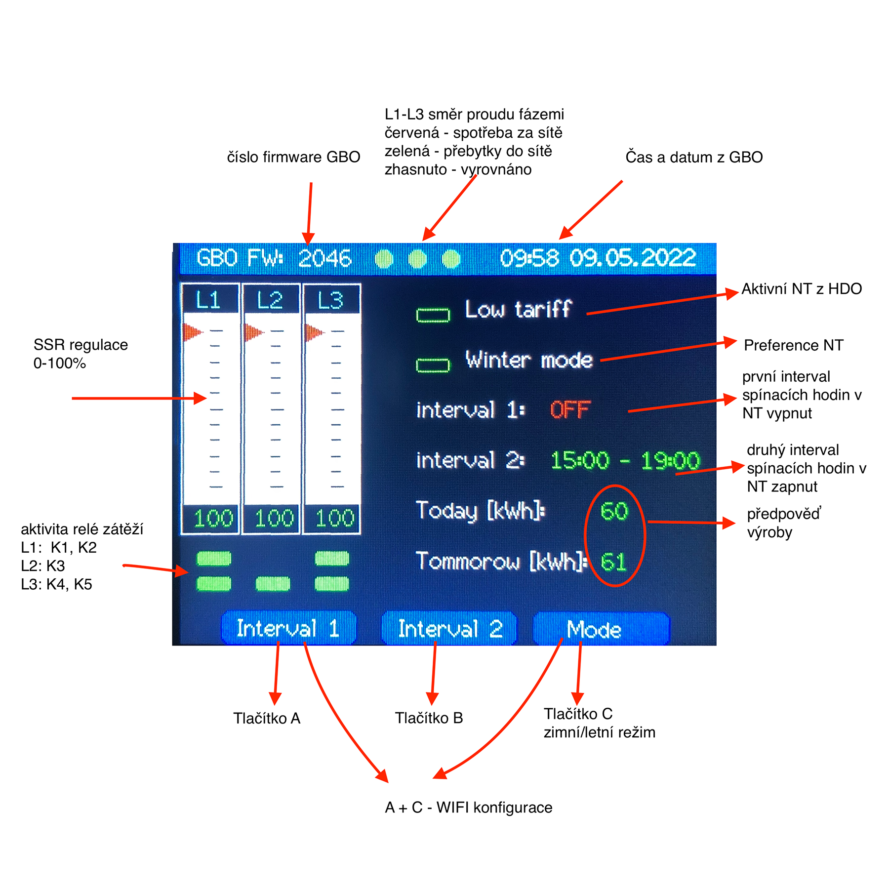
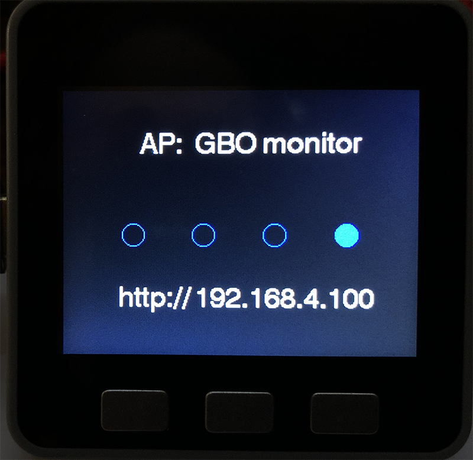
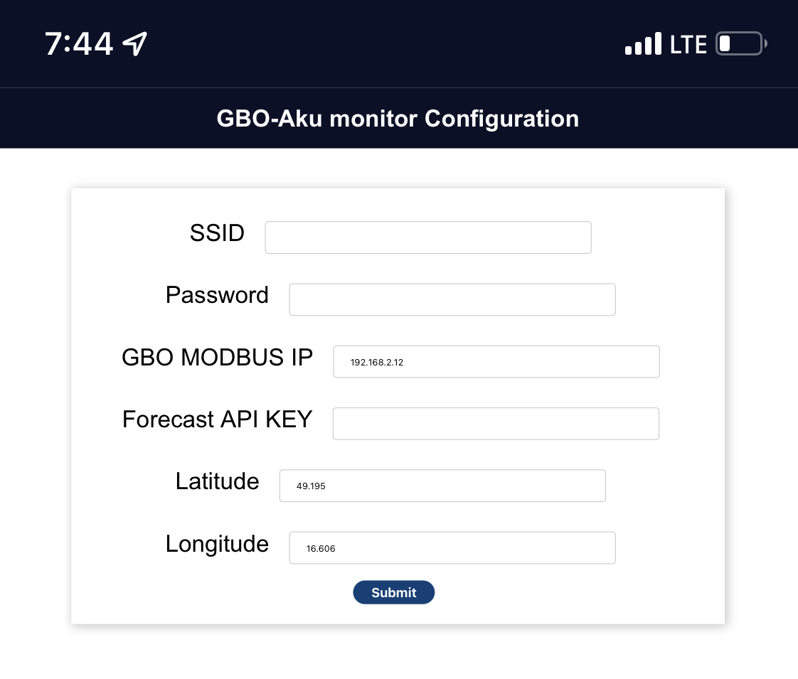

# Simple monitor for GBO-AKU

Only in Czech ...

Monitor využívá dostupný HW M5Stack ve verzi s tlačítky, např. https://shop.m5stack.com/collections/m5-controllers/products/esp32-basic-core-iot-development-kit-v2-6

Monitor zobrazuje směry proudů v jednotlivých fázích, stavy relé K1-K5 a řízení PI regulátorů SSR v procentech. Za pomocí www.pvforecast.cz vypočte a zobrazuje předpověď pro aktuální a následný den výroby v kWh. Výpočet je vztažen k ploše elektrárny viz. constants.h. 

Monitor zobrazuje datum a čas z GBO, pro kontrolu. Vlastní korekce je nutná přes GreenBonO_HMI.exe. 

Za pomocí tlačítek Interval 1 a 2 lze vypínat spínací hodiny SH2. Např. při dobré předpovědi nechceme natápět bojler z NT, kdy elektrárna ještě nevyrábí (interval 1).

Tlačítkem Mode se mění zimní a letní režim, kdy se prolínají přebytky elektr8rny s HDO (bit 5 EEConfigWordL). V zimním režimu má přednost NT a spínací hodiny SH2 před PI regulátorem (bez ohledu na přebytky). 

Časy intervalů se přepisují z GBO NT. 

GBO-Aku popis viz. http://www.yorix.cz/cz/greenbono/gbo-aku.htm

Zařízení disponuje rozhraním RS485 s protokolem MODBUS RTU. Na stránkách výrobce je uvedeno připojení k počítači přes sériovou linku, tak i přes ethernet. Zařízení se konfiguruje za pomocí aplikace GreenBonO_HMI.exe. Aplikace GreenBonO_HMI neumí pracovat s protokolem Modbus TCP, ale pouze se sériovou linkou přes TCP. Lokálně pak komunikuje RS485 s protokolem MODBUS RTU.

Pro monitoring je výhodnější používat Modbus TCP, ale zároveň se hodí pro občasnou konfigurací mít k dispozici sériovou linku přes TCP. Jako vhodný se jeví např. převodník Waveshare k instalci na DIN lištu s oběma režimy provozu.

Link na wiki převodníku: https://www.waveshare.com/wiki/RS485_TO_ETH_(B)

konfigurace převodníku pro GBO-AKU viz. https://github.com/xventus/GBO-AKU-NR

Provozováno s GBO-AKU s FW wattrouter 3 fáze. 

##  Licence

pouze pro nekomerční účely

##  Zprovoznění

1. Visual Studio Code + Platformio
2. v platformio.ini nastavit správný sériový port např. upload_port = /dev/cu.usbserial-015F9939
3. v /src/constants.h nastavit konstantu gridSize velikost plochy panelů v m2, popř. účinnost v efficiencyOfPanels
4. nahrát do ESP32 filesytem za pomocí GUI -  Upload Filesystem Image
5. nahrát vlastní program - Upload
6. při prvním spuštění se vytvoří AP s názvem `GBO Monitor` nebo součastně stisknout tlačítka A a C
7. web browser http://192.168.4.100 a vyplnit web formulář
8. restart

##  TODO
 - korekce času GBO přes NTP server

##  Screens

